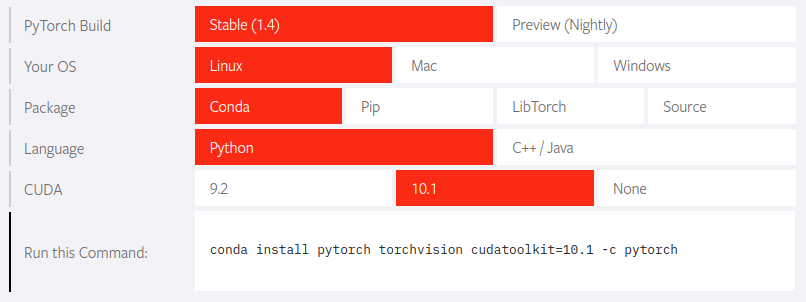

# Environment Config

To config a computer for deep learning or deep reinforcement learning, we install *cuda*, *cudnn*, *torch* and so on.
There may be some problems during install this software. I record my process of configuring the **DL environment**. My 
computer is a DELL PRECISION TOWER 7810 working station with Ubuntu 16.04 OS and Quadro VGA controller with M5000 GPU.

## Torch ,TF, CUDA and cudnn

The first thing you need to do is to make sure the match of the versions among all of these softwares.
The first step is to check the **CUDA** version corresponding with [**pytorch**](https://pytorch.org/).



The second step is to verify the **nvidia driver** version corresponding with **CUDA**.


Then, you need to make sure the the **cudnn** version corresponding with **CUDA**. This can be seen in 
[**cudnn**](https://developer.nvidia.com/rdp/cudnn-archive).


The version on my machine are as follows:

software      | version
--------------|--------
torch         | 1.4
CUDA          | 10.1
nvidia driver | 418
cudnn         | 7.5
tensorflow-gpu| 1.4

After these, you can start install them.

### Nvidia driver
You can use the following command to check the corresponding driver for your machine

``ubuntu-drivers devices`` 

Then, you can use command to install the nvidia driver.

```
sudo add-apt-repository ppa:graphics-drivers/ppa
sudo apt-get update
sudo apt install nvidia-418
```

You could watch the nvidia driver using:

``nvidia-smi`` or ``watch -n 10 nvidia-smi``

If the error is 
>Failed to initialize NVML: Driver/library version mismatch

This is because the kernel module of the nvidia is mismatch with current driver version. Under this condition.
restarting the machine is a good choice.

Then, you can see (the version is wrong because I can't get my working station now)


Some useful commands:

- see the info of VGA driver:
``lspci |grep VGA``
- see the info of nvidia VGA hard ware: 
``lspci |grep -i nvidia``

### CUDA

You can follow the tutorial in homepage of [**CUDA**](https://developer.nvidia.com/cuda-toolkit).
But you could only get the latest version of CUDA.
For history version, you need to visit [**history release**](https://developer.nvidia.com/cuda-toolkit-archive).
For version `10.1`, you can get it [**here**](https://developer.nvidia.com/cuda-10.1-download-archive-base).

Then, you can follow the command as follows:
```
sudo dpkg -i cuda-repo-ubuntu1604-10-1-local-10.1.105-418.39_1.0-1_amd64.deb
sudo apt-key add /var/cuda-repo-<version>/7fa2af80.pub
sudo apt-get update
sudo apt-get install cuda
```

In fact, it would be convient to install CUDA. However, I made a mistake during my procedure.
I tried to install `10.2` first and shut down before the last step. However, `dpkg` record the 
package in its memory. To install `10.1`, you need to run the following command first.
```
dpkg -r cuda-repo-<version>
dpkg -P cuda-repo-<version>
```
Some useful commands:
- see the version of CUDA:
``cat /usr/local/cuda/version.txt``

### cudnn

It is very easy to install cudnn. Here, I recommand you to install cudnn use `tar` rather than `deb`.

First, download it from [**cudnn**](https://developer.nvidia.com/rdp/cudnn-archive).
Then, run the following command:
```
sudo cp cuda/include/cudnn.h /usr/local/cuda/include/
 
sudo cp cuda/lib64/libcudnn* /usr/local/cuda/lib64/
 
sudo chmod a+r /usr/local/cuda/include/cudnn.h
 
sudo chmod a+r /usr/local/cuda/lib64/libcudnn*
```

Some useful commands:
- see the version of cudnn:
``cat /usr/local/cuda/include/cudnn.h | grep CUDNN_MAJOR -A 2``

### There are some method you could refer
- [using run file to install](https://blog.csdn.net/EliminatedAcmer/article/details/80528980)
- [some useful advice](https://blog.csdn.net/Marlon1993/article/details/101730005)
- [command line](https://blog.csdn.net/junzia/article/details/80871145)
- [do it in three ways](https://blog.csdn.net/wanzhen4330/article/details/81699769)
 